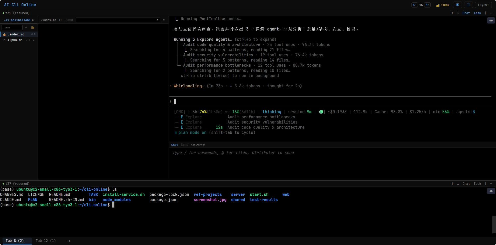

# AI-Cli Online

[](https://www.npmjs.com/package/ai-cli-online)
[](LICENSE)
[](https://nodejs.org/)

轻量级 Web 终端，在浏览器中访问 Claude Code / Codex 或任意 CLI。

适合**网络不稳定、SSH 经常断线**的场景，也可作为**本地有状态终端**使用 — 会话、布局和草稿在刷新后自动恢复。

**npm:** https://www.npmjs.com/package/ai-cli-online | **GitHub:** https://github.com/huacheng/ai-cli-online

[**English**](README.md)



## 功能特性

- **完整 Web 终端** — xterm.js + WebGL 渲染，二进制协议实现超低延迟
- **会话持久化** — tmux 保证断网后进程存活；固定 socket 路径，服务重启后自动重连
- **Tab 多标签页** — 独立终端分组，布局跨刷新持久化
- **分屏布局** — 水平/垂直任意嵌套分割
- **Mermaid 图表** — 甘特图、流程图等 Mermaid 图表暗色主题内联渲染，CDN 双源容错
- **Plan 批注** — 4 种批注类型（插入/删除/替换/评注），选中文本弹出浮动按钮组，持久化存储
- **编辑器面板** — 多行编辑 + 草稿服务端持久化 (SQLite) + undo 撤销栈 + 斜杠命令（`/history` 等）
- **复制粘贴** — 鼠标选中自动复制到剪贴板，右键粘贴到终端
- **文件传输** — 上传文件到 CWD，浏览/下载通过 REST API
- **滚动历史** — capture-pane 回看，保留 ANSI 颜色
- **会话管理** — 侧边栏管理 session（恢复/删除/重命名）
- **中文等宽字体** — 通过 CDN 加载霞鹜文楷等宽 (LXGW WenKai Mono)，unicode-range 按需分片，浏览器仅下载实际用到的字符
- **字体大小控制** — 可调节终端字体大小 (A−/A+)，设置服务端持久化
- **版本号显示** — Header 显示当前版本号，构建时从 `package.json` 自动注入
- **网络指示器** — 实时 RTT 延迟显示 + 信号条
- **自动重连** — 指数退避 + jitter 防雷群效应
- **安全认证** — Token 认证 + timing-safe 比较
- **安全加固** — symlink 穿越防护、未认证 WebSocket 连接限制、TOCTOU 下载防护、CSP Headers (frame-ancestors / base-uri / form-action)

## 功能对比：AI-Cli Online vs OpenClaw

| 维度 | AI-Cli Online | OpenClaw |
|------|--------------|----------|
| **定位** | 轻量 Web 终端 | AI Agent 编排平台 |
| **核心用途** | 浏览器远程终端访问 | 多渠道 AI 助手 |
| **终端仿真** | xterm.js + WebGL | 无 |
| **会话持久化** | tmux（断网存活） | Gateway 内存状态 |
| **多标签/分屏** | Tab + 任意嵌套分屏 | 无 |
| **消息渠道** | WebSocket 单通道 | 16+（WhatsApp / Telegram / Slack / Discord...） |
| **原生应用** | 无（纯 Web） | macOS + iOS + Android |
| **语音交互** | 无 | Voice Wake + Talk Mode |
| **AI Agent** | 无内置（运行任意 CLI） | Pi Agent 运行时 + 多 Agent 路由 |
| **Canvas/UI** | Plan 批注系统（Markdown） | A2UI 实时可视化工作区 |
| **文件传输** | REST API 上传/下载 | 渠道原生媒体 |
| **安全模型** | Token auth + timing-safe | 设备配对 + DM 策略 + Docker 沙箱 |
| **可扩展性** | Shell 脚本 | 33 扩展 + 60+ Skills + ClawHub |
| **传输协议** | 二进制帧（超低延迟） | JSON WebSocket |
| **部署** | 单机 Node.js | 单机 + Tailscale Serve/Funnel |
| **技术栈** | React + Express + node-pty | Lit + Express + Pi Agent |
| **包大小** | ~1 MB | ~300 MB+ |
| **安装** | `npx ai-cli-online` | `npm i -g openclaw && openclaw onboard` |

## 快速开始

### 方式一：npx 一键启动（推荐）

```bash
npx ai-cli-online
```

### 方式二：全局安装

```bash
npm install -g ai-cli-online
ai-cli-online
```

### 方式三：从源码运行

```bash
git clone https://github.com/huacheng/ai-cli-online.git
cd ai-cli-online
npm install
npm run build
npm start
```

## 前提条件

- Node.js >= 18
- tmux 已安装（`sudo apt install tmux` 或 `brew install tmux`）

## 配置

创建 `server/.env`：

```env
PORT=3001                        # 服务端口
HOST=0.0.0.0                     # 绑定地址
AUTH_TOKEN=your-secret-token     # 认证 Token（生产环境必须设置）
DEFAULT_WORKING_DIR=/home/user   # 默认工作目录
HTTPS_ENABLED=true               # nginx 反代时设为 false
TRUST_PROXY=1                    # nginx 反代时设为 1
```

完整选项参见 `server/.env.example`。

## 架构

```
浏览器 (xterm.js + WebGL) <-- WebSocket binary/JSON --> Express (node-pty) <--> tmux session --> shell
```

- **前端**: React + Zustand + xterm.js（WebGL 渲染）
- **后端**: Node.js + Express + node-pty + WebSocket + better-sqlite3
- **会话管理**: tmux（持久化终端会话）
- **布局系统**: Tab 标签页 + 递归树形结构（LeafNode / SplitNode）
- **传输协议**: 二进制帧（热路径）+ JSON（控制消息）
- **数据持久化**: SQLite（编辑器草稿）

### 性能优化

- **二进制协议** — 1 字节前缀帧用于终端 I/O，消除 JSON 序列化开销
- **TCP Nagle 禁用** — `setNoDelay(true)` 消除最多 40 ms 按键延迟
- **WebSocket 压缩** — `perMessageDeflate`（level 1，threshold 128 B），带宽减少 50-70%
- **WebGL 渲染器** — 渲染吞吐量提升 3-10 倍
- **并行初始化** — PTY 创建、tmux 配置、resize 并行执行
- **智能重渲染** — 响应式布局 hook、条件 Zustand selector、分批 stat 调用

## 项目结构

```
ai-cli-online/
├── shared/          # 共享类型定义 (ClientMessage, ServerMessage)
├── server/          # 后端服务 (TypeScript)
│   └── src/
│       ├── index.ts      # 主入口 (HTTP + WebSocket + REST API)
│       ├── websocket.ts  # WebSocket <-> PTY 双向 relay (二进制 + JSON)
│       ├── tmux.ts       # tmux 会话管理
│       ├── files.ts      # 文件操作
│       ├── pty.ts        # node-pty 封装
│       ├── db.ts         # SQLite 数据库 (草稿持久化)
│       ├── auth.ts       # 认证工具
│       └── types.ts      # 类型定义
├── web/             # 前端应用 (React + Vite)
│   └── src/
│       ├── App.tsx        # 主应用组件
│       ├── store.ts       # Zustand 状态管理
│       ├── components/    # UI 组件
│       ├── hooks/         # React Hooks
│       └── api/           # API 客户端
├── start.sh         # 生产启动脚本
└── package.json     # Monorepo 配置
```

## 开发

```bash
# 开发模式（前后端分离）
npm run dev

# 构建
npm run build

# 生产模式（构建 + 启动）
bash start.sh
```

### systemd 服务 + nginx 反向代理

```bash
sudo bash install-service.sh             # 交互安装 (systemd + 可选 nginx 反代)
sudo systemctl start ai-cli-online       # 启动服务
sudo journalctl -u ai-cli-online -f      # 查看日志
```

安装脚本会：
1. 创建 systemd 服务，支持开机自启和进程管理
2. 检测 nginx 并可选配置反向代理（WebSocket 支持、SSL、`client_max_body_size`）
3. nginx 启用时自动设置 `HTTPS_ENABLED=false` 和 `TRUST_PROXY=1`

## License

MIT
